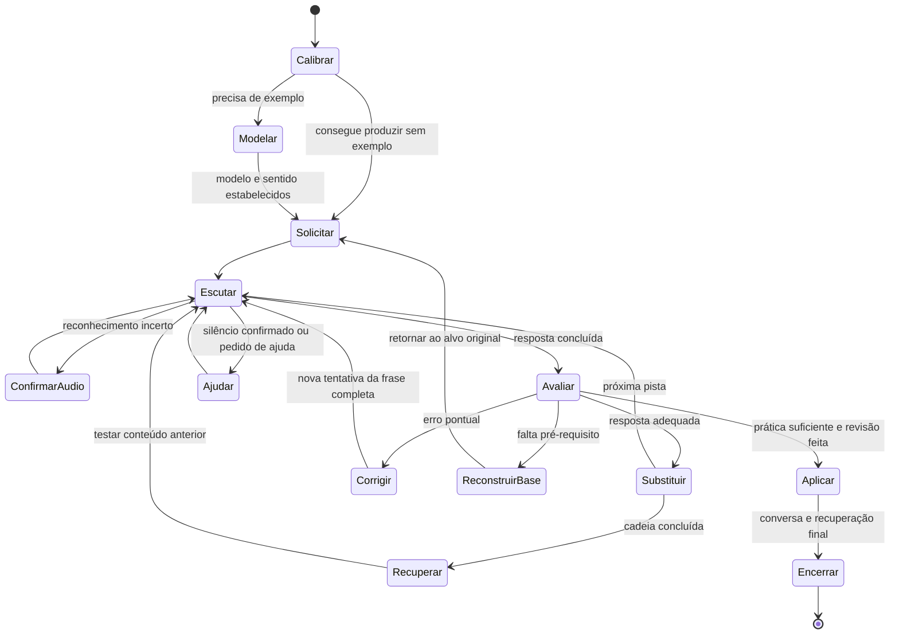

# Dinâmica da aula e proposta de tutor de IA

## Conclusão principal

O núcleo da dinâmica é **produção oral guiada com substituições encadeadas, ajuda adaptativa e recuperação de conteúdo anterior**. O professor estabelece uma frase, pede que o aluno a produza, dá uma pista curta e espera que ele reconstrua a frase inteira. Quando surge dificuldade, ele corrige um ponto ou volta a um pré-requisito e reconstrói a estrutura por etapas. O material exibido oferece apoio; a folha pessoal organiza as intervenções do professor.

O trecho mais esclarecedor está por volta de **11:47–12:18**: o próprio professor explica o papel do modelo inicial, da solicitação em português e das substituições em inglês. Ele exemplifica a cadeia com *It was sunny this morning*, seguida das pistas *windy*, *rainy* e *yesterday*. Também indica que este aluno nem sempre precisa receber o modelo que seria necessário para um aluno com menos autonomia.

Para replicar isso, a IA precisa preservar a frase em construção e decidir qual intervenção ajuda o aluno a produzir a próxima versão. Um conjunto de perguntas independentes perderia uma parte importante dessa dinâmica.

## Base da análise e limites

- Áudio: arquivo de **39 minutos e 12,73 segundos**, analisado por transcrição automática com marcações temporais e uma segunda passagem em trechos relevantes.
- Imagem: leitura visual da folha pessoal, incluindo frases e variações separadas por barras.
- PDF: extração de texto e inspeção visual das duas páginas.

Os tempos abaixo são aproximados. A transcrição tem falhas nos trechos bilíngues, em nomes próprios e em algumas repetições; não a trato como transcrição literal certificada. Não fiz identificação acústica formal dos falantes nem medição validada de sobreposição, latência ou duração média de turnos. Por isso, não atribuo um tempo exato de espera ou um percentual de fala ao professor.

O áudio não permite confirmar o que estava na tela em cada segundo. A correspondência entre falas e seções do PDF permite relacionar os exercícios ao material, mas não comprova ações visuais como esconder respostas ou trocar páginas. A gravação começa com uma explicação em andamento; não comprova como foi a abertura completa da aula.

Distingo três categorias ao longo da análise: o que aparece na gravação, o que consta nos materiais e o que proponho como regra para a IA. Os diálogos ilustrativos são reconstruções a partir do conteúdo, não citações literais da gravação.

## 1. Sequência efetiva da gravação

| Trecho aproximado | O que acontece | Função pedagógica |
|---|---|---|
| 00:00–04:11 | Explicação de perguntas com *how* e *what … like*, exemplos de clima e características de pessoas; contraste com *look like*. | Trabalhar a intenção da pergunta e evitar tradução literal. O professor relaciona a estrutura a conteúdo anterior. |
| 04:12–05:14 | Modelo e repetição de *What was the weather like yesterday?*, *It was cold and cloudy* e *I'm cold. I need some hot tea*. Explicação de *I'm cold* versus *I have a cold*. | Associar forma, pronúncia e sentido; prevenir uma interpretação equivocada de *cold*. |
| 05:15–06:22 | Pedidos em português com mudanças de tempo e lugar; retomada da frase sobre clima; correção do final de *cloudy*. | Passar da repetição à produção e manter a palavra corrigida dentro de uma frase completa. |
| 06:22–07:18 | Conversa paralela. | Relação pessoal; não constitui um bloco de treino estruturado. |
| 07:18–09:04 | Seção *Use of grammar*: perguntas com *was/were*, relação com perguntas já aprendidas no presente, explicação do sujeito *it* nas frases meteorológicas. | Transferir uma estrutura conhecida para o passado e corrigir interferência do português. |
| 09:04–18:52 | Conversa extensa sobre transformar a prática em IA e sobre viabilidade técnica/comercial. Dentro dela, o professor descreve o procedimento de substituição e propõe conversação após o treino. | Este intervalo contém explicações valiosas sobre o método, mas não equivale a uma sequência contínua de exercícios. |
| Cerca de 18:52–20:58 | Retomada de perguntas do PDF: praia, pessoa rude, café, pessoa educada e celular. | Produção das estruturas interrogativas em contextos diferentes. |
| 20:58–24:26 | Conversa pessoal/profissional. | Interação espontânea; não há evidência suficiente para tratá-la como uma simulação planejada com os alvos da lição. |
| Cerca de 24:45–26:48 | Itens próximos da seção *Grammar* da folha: *teacher / neighbor / co-worker*, clima na praia e pessoas estudando juntas. | Substituição de vocabulário em uma estrutura preservada; entrada em estruturas com verbo em *-ing*. |
| 26:48–30:15 | Dificuldade com jantar e expressões de refeições. O professor reconstrói *have breakfast/lunch/dinner*, frases simples, sujeitos, progressivo e perguntas; trabalha também *work out*. | Recuperar pré-requisitos, em vez de apenas fornecer a tradução da frase difícil. |
| Cerca de 30:15–33:12 | Conversa paralela, inclusive sobre séries/filmes. | Intervalo social; a atividade permanece retomável. |
| 33:13–35:48 | Retomada de *work out*, produção de perguntas com *when* e *do*, incluindo *When do you want to work out with me?*. | Recombinar conteúdo anterior e verificar a capacidade de construir perguntas. |
| 35:48–37:17 | Retorno à pergunta sobre o clima no passado, com mudanças de lugar; feedback e encerramento pedagógico. | Recuperação posterior de uma estrutura trabalhada no início. |
| Após 37:17 | Conversa final e despedida. | Fechamento social. |

Uma distinção importante: o professor **propõe**, durante a conversa sobre IA, uma etapa de simulação contextualizada depois do treino. A gravação não demonstra uma implementação completa e sistemática dessa etapa. Há conversa espontânea, mas ela não deve ser automaticamente classificada como esse exercício planejado.

## 2. Folha pessoal e material exibido: funções diferentes

### Folha pessoal: roteiro de intervenções

A imagem contém quatro blocos:

| Bloco | Exemplos da folha | O que a organização permite fazer |
|---|---|---|
| **Verbs (Extensões em inglês)** | “Eu estava em casa. / She / he”; “Eu não era seu amigo. / student / She”; “Vocês estavam no cinema? / mall / drugstore”. | Mudar sujeito, complemento ou lugar e exigir ajustes gramaticais. A anotação mistura enunciado em português e pistas em inglês. |
| **Vocabulary** | *It was sunny this morning. / windy / rainy / yesterday*; filme/série/vídeo; chefe/gerente/advogado; *reliable/unreliable*. | Introduzir a palavra em uma frase e depois reutilizar a estrutura com substituições. |
| **Useful sentences** | *What was the weather like today? / yesterday / last month*; *What's the weather like today? / now / in your city?*; frio/calor/neve/vento. | Trabalhar expressões completas e contrastar presente, passado, tempo e lugar. |
| **Grammar** | *Was he your teacher last year? / co-worker / neighbor*; clima na praia; “Eles estavam estudando juntos? / jantando / malhando”. | Aplicar estruturas interrogativas e ampliar a complexidade das combinações. |

As barras funcionam como uma lista compacta de possibilidades de transformação. Elas não são uma frase para o aluno ler de uma vez. No áudio, o professor confirma que possui folhas que orientam a prática e demonstra o uso de pistas em inglês.

A folha também é uma organização mais ampla que a sequência efetivamente registrada. Não há evidência de que todos os itens de **Verbs** e **Vocabulary** tenham sido executados integralmente neste áudio. A seção **Grammar** tem correspondência particularmente clara com a prática da parte final.

### PDF: referência para o aluno

A página 1 apresenta *was/were*, negativas e vocabulário. A página 2 apresenta **Useful language** e **Use of grammar**, com frases-modelo e perguntas contextualizadas. O professor usa conteúdos dessas seções na gravação.

O PDF torna visível o conteúdo que sustenta a produção. A folha pessoal dá ao professor um plano de como exigir transformações desse conteúdo. A parte decisiva acontece no intercâmbio oral: uma pista curta pode exigir uma frase inteira que não está escrita exatamente daquele modo no PDF.

Para a IA, proponho dois objetos separados:

- **Painel do aluno:** estruturas, vocabulário, exemplos e ajudas liberadas no momento adequado.
- **Roteiro interno:** frases-base, pistas, respostas de referência, alternativas válidas, habilidades exigidas e pontos a revisar.

Não se deve mostrar uma resposta completa antes de uma tentativa independente, salvo quando a etapa for explicitamente de modelagem. Isso é uma regra proposta para a implementação; não afirmo que o professor esconda visualmente as respostas do PDF.

## 3. Tipos de solicitação e resposta

### A. Modelo e repetição

O professor usa uma instrução equivalente a “fala comigo”, apresenta a frase e recebe sua repetição. Isso aparece com as frases de **Useful language** e, na correção de refeições, com *to have breakfast*.

Função: oferecer uma forma pronunciável e uma estrutura de referência. Limite: repetir bem não prova que o aluno consiga construir ou transformar a frase sem ajuda.

### B. Produção solicitada em português

Uma solicitação como “como estava o clima ontem?” pede que o aluno produza a pergunta em inglês. A resposta-alvo é *What was the weather like yesterday?*, não uma informação sobre o clima.

Essa distinção deve ser explícita para a IA. Em “diga em inglês…”, avalia-se a construção da frase; em “responda à pergunta…”, avalia-se uma resposta comunicativa. O mesmo conteúdo pode aparecer nos dois modos.

### C. Substituição com pista em inglês

Depois de estabelecer uma frase, o professor oferece um elemento como *windy*, *yesterday*, *neighbor* ou *co-worker*. O aluno precisa produzir a frase transformada, preservando o restante.

Há dois trabalhos simultâneos: compreender a pista em inglês e executar a mudança gramatical/lexical. O professor menciona essa função de compreensão ao explicar o procedimento.

### D. Elicitação de uma regra ou de um pré-requisito

O professor pergunta qual é o passado de *to be*, por que existe *it*, como dizer uma refeição e em qual parte da expressão colocar *-ing*. Ele tenta obter a operação do aluno, em vez de resolver sempre a frase inteira por ele.

### E. Contraste de sentido

Exemplos relevantes: *I'm cold* versus *I have a cold*; *what … like* versus *look like*. A explicação liga inglês a intenção comunicativa e a conhecimentos anteriores.

### F. Construção por etapas

Na dificuldade com refeições, o professor passa por unidades mais simples antes de recuperar as combinações complexas: expressão lexical, frase, sujeito/plural, progressivo e pergunta. Esse procedimento é mais amplo que uma correção de palavra.

### G. Recuperação posterior

A pergunta sobre o clima no passado retorna no fim, depois de outros exercícios e intervalos. Isso permite verificar se a estrutura continua acessível fora da repetição imediata.

## 4. Padrões de correção, repetição e feedback

### Correção localizada

- **Pronúncia/forma sonora:** por volta de 06:04, chama atenção para o final de *cloudy* e pede nova produção. O episódio mostra a estratégia; não permite inferir uma avaliação fonética completa do aluno.
- **Sujeito obrigatório:** por volta de 07:50–09:04, explica por que *was sunny…* precisa de um sujeito, como *it*. É um ponto de transferência do português, que permite “estava ensolarado” sem sujeito expresso.
- **Concordância e perguntas:** destaca *was* em relação a sujeito singular e retoma perguntas com *were* e sujeitos plurais.
- **Forma verbal:** na sequência de refeições, leva o aluno a aplicar *-ing* ao verbo da expressão, produzindo *having dinner*.

### Correção com reconstrução

Quando falta familiaridade com *have* em expressões de refeições, a frase difícil é temporariamente suspensa. O professor trabalha uma família de expressões e combinações. A regra para a IA deve ser: **um erro que revela um pré-requisito ausente abre uma sequência de apoio; depois, a sequência retorna ao alvo original**.

### Repetição com funções diferentes

1. Repetir um modelo fornece a forma inicial.
2. Repetir depois de uma correção estabiliza o ponto trabalhado.
3. Repetir a estrutura com substituições pratica transformação.
4. Recuperar depois de outros itens testa disponibilidade posterior.

Uma réplica que apenas diga “repita” várias vezes não reproduz essas quatro funções.

### Feedback e clima da interação

Há confirmações curtas, como *very good*, *perfect* e “muito bom”, além de humor e comentários informais. O professor normaliza dificuldades com formas que não são naturais para o aluno e relaciona automatização a uso repetido.

O tom ajuda a manter a disposição para tentar, mas não precisa ser copiado literalmente. Para a IA, recomendo um tom cordial e breve, sem reproduzir palavrões, comentários pessoais sobre terceiros ou todos os intervalos sociais.

Por volta de 34:04–34:29, o professor explica que não corrigiu imediatamente uma escolha de refeição porque o aluno fez a combinação que ele buscava: *have* + refeição. A transcrição sugere uma troca entre *lunch* e *dinner*. O ponto seguro é a **priorização do ganho estrutural**, explicitada pelo professor; a atribuição exata de cada fala é menos segura. Isso não estabelece uma regra de aceitar qualquer erro de vocabulário. Para a IA, uma resposta pode conter um acerto no alvo e um erro secundário: “Você acertou having; para jantar, use dinner. Diga a frase toda.” Registre os dois aspectos separadamente.

## 5. Progressão de dificuldade e regras implícitas

O percurso não é uma lista linear de frases cada vez maiores. Ele alterna apoio, transformação, ampliação e retorno a estruturas anteriores.

As regras mais relevantes são:

1. **Modelo inicial depende do aluno.** O professor afirma que este aluno pode dispensar uma ajuda que outros precisariam receber.
2. **A frase é a unidade de prática.** A pista pode ser uma palavra, mas a produção esperada reconstrói a estrutura.
3. **Substituições se acumulam dentro de uma cadeia.** Depois de *sunny → windy → rainy*, a pista *yesterday* muda o tempo e preserva *rainy*.
4. **Uma mudança pode exigir ajustes associados.** *He → they* exige *was → were*; não basta trocar o pronome.
5. **Conteúdo anterior permanece utilizável.** O professor conecta perguntas no presente a perguntas no passado e recupera refeições aprendidas antes.
6. **A compreensão da regra e o uso automático são diferentes.** As explicações reconhecem essa diferença; o treino busca uso, não apenas uma resposta sobre gramática.
7. **A dificuldade muda a rota.** O professor pode abandonar temporariamente a pergunta complexa para reconstruir sua base.
8. **A retomada deve preservar o alvo.** Para a IA, uma reconstrução no presente não deve ser marcada como conclusão de um exercício que exigia o passado.
9. **O uso de português tem função.** Ele esclarece significado, solicita produção e explica dificuldades; pistas em inglês acrescentam compreensão oral.
10. **Interação social não elimina o plano.** O professor volta aos exercícios depois dos desvios. A IA precisa conservar a posição na sessão.

Não identifico um limiar numérico comprovado, como “três acertos para avançar”, nem uma regra universal de duração. Esses parâmetros terão de ser definidos e avaliados na implementação.

## 6. Timing e alternância de turnos

O ritmo depende da atividade:

- Na explicação, o professor ocupa turnos mais longos e intercala perguntas de compreensão.
- Na prática de substituição, predomina a alternância pista curta → frase do aluno → confirmação ou correção → próxima pista.
- Na dificuldade, a mesma etapa recebe mais tempo, pistas adicionais ou uma reconstrução.
- Em conversa paralela, os turnos crescem e o exercício é suspenso.

Para uma interface de voz, proponho regras operacionais, sem atribuí-las como medidas do professor:

| Evento | Resposta da implementação |
|---|---|
| O aluno ainda está falando ou se autocorrigindo | Continuar escutando; não lançar outra pista. |
| Há uma pausa breve | Tratar como possível planejamento, considerando a frase ainda incompleta. |
| Há silêncio prolongado e confirmado | Oferecer uma pista curta; conservar a mesma pergunta. |
| O reconhecimento está incerto | Pedir confirmação; não registrar automaticamente um erro linguístico. |
| O aluno interrompe com uma dúvida | Suspender a avaliação, responder e retomar a atividade pendente. |
| O tutor foi interrompido durante sua fala | Parar a reprodução de áudio e ouvir o aluno. |

Como configuração inicial experimental, uma ajuda após cerca de **5–8 segundos de silêncio confirmado** pode ser testada e ajustada. Isso não é uma medição da aula nem deve superar sinais de que o aluno está planejando ou tentando falar. A espera por uma resposta exige um controlador de voz; um prompt isolado não controla microfone, detecção de fala ou interrupção.

## 7. Máquina de estados proposta



O diagrama mostra o ciclo principal. A transição de **Avaliar** depende também do tipo de item pendente: uma resposta ao item de recuperação pode abrir outro bloco ou a aplicação, em vez de sempre iniciar uma nova substituição. Uma dúvida ou conversa paralela suspende qualquer estado, guardando seu ponto de retorno.

| Estado | Ação do tutor | Condição de saída |
|---|---|---|
| Calibrar | Tentar um item simples e escolher o nível de apoio. | Decidir se precisa de modelo. |
| Modelar | Dar frase em inglês, verificar sentido e solicitar repetição. | Aluno tem uma referência utilizável. |
| Solicitar | Pedir uma frase, pergunta ou transformação, deixando claro o modo. | Solicitação emitida. |
| Escutar | Esperar a produção; aceitar autocorreção. | Resposta concluída, pedido de ajuda ou incerteza de áudio. |
| Avaliar | Verificar intenção, estrutura e transformação. | Classificar resposta adequada, erro pontual ou falta de pré-requisito. |
| Corrigir | Oferecer pista → trecho correto → modelo completo, conforme necessário. | Nova tentativa da mesma frase. |
| Reconstruir base | Ensinar uma sequência curta de pré-requisitos. | Voltar ao item originalmente suspenso. |
| Substituir | Confirmar a frase aceita e emitir a próxima pista. | Nova tentativa ou fim da cadeia. |
| Recuperar | Testar depois uma estrutura ou erro anterior, com contexto diferente. | Registrar o desempenho e abrir o próximo bloco. |
| Aplicar | Fazer perguntas reais ou uma simulação com vocabulário praticado. | Produção suficiente para um fechamento breve. |
| Encerrar | Recuperar pontos prioritários e resumir o que precisa de revisão. | Registro salvo para a próxima sessão. |

### Memória mínima da sessão

```json
{
  "modo": "treino_controlado",
  "estado": "escutar",
  "bloco": "clima_passado",
  "frase_base": "It was sunny this morning.",
  "ultima_frase_aceita": "It was rainy this morning.",
  "pista_pendente": "Yesterday",
  "alvo_pendente": "It was rainy yesterday.",
  "habilidades": ["sujeito_it", "was", "adjetivo_clima", "tempo"],
  "nivel_ajuda": 0,
  "tentativas_item": 0,
  "erros_para_revisar": [],
  "retorno_apos_apoio": null
}
```

**Regra de atualização:** uma resposta errada não sobrescreve `ultima_frase_aceita`. A pista e o alvo continuam pendentes até a correção, a desistência registrada ou uma decisão explícita de mudar o item. Em um novo bloco, a frase-base é redefinida.

### Como avaliar sem exigir texto idêntico

No treino controlado, aceite contrações e variantes naturais equivalentes, mas verifique que a substituição foi feita e que o restante relevante foi preservado. Na conversa, aceite diferentes respostas verdadeiras e pertinentes. O aluno pode dizer que estava chuvoso mesmo se o exemplo do material usa ensolarado.

Separar três avaliações evita erros de produto: **transformação solicitada**, **correção/inteligibilidade linguística** e **confiança do reconhecimento de voz**. Baixa confiança de áudio não deve se transformar em uma nota negativa de gramática ou pronúncia.

## 8. Exemplos concretos reconstruídos

### Exemplo 1 — Cadeia cumulativa demonstrada pelo professor

| Intervenção do tutor | Produção esperada |
|---|---|
| “Diga em inglês: estava ensolarado hoje de manhã.” | *It was sunny this morning.* |
| “Windy.” | *It was windy this morning.* |
| “Rainy.” | *It was rainy this morning.* |
| “Yesterday.” | *It was rainy yesterday.* |

Se o aluno disser *It was sunny yesterday*, a frase é gramatical, mas perdeu a alteração anterior. A correção deve chamar atenção para a cadeia: “Mantém rainy; muda só o tempo.”

### Exemplo 2 — Substituição de sujeito com concordância

Base da folha: “Eu estava em casa. / She / he”. Extensão proposta para testar *were*:

| Pista | Produção esperada |
|---|---|
| Frase-base | *I was at home.* |
| “She.” | *She was at home.* |
| “He.” | *He was at home.* |
| “They.” | *They were at home.* |

Se o aluno disser *They was at home*, comece por “Com they, was ou were?”. Depois peça a frase inteira. A pista “They” desta última linha é uma extensão de implementação, não um item literal dessa linha da folha.

### Exemplo 3 — Pergunta com substituição lexical

Da seção **Grammar**:

1. Tutor solicita “Ele foi seu professor no ano passado?” → *Was he your teacher last year?*
2. Pista “Neighbor.” → *Was he your neighbor last year?*
3. Pista “Co-worker.” → *Was he your co-worker last year?*

O aluno mantém a pergunta e substitui a relação. Se produzir uma afirmação, como *He was your neighbor last year*, a intervenção deve recuperar o formato interrogativo.

### Exemplo 4 — Reconstrução de pré-requisito

Alvo da folha: “Eles estavam jantando juntos?” → *Were they having dinner together?*

Se faltar a expressão de refeição, use uma escada inspirada na gravação:

1. *Have dinner.*
2. *I have dinner.*
3. *They are having dinner.*
4. *They are having dinner together.*
5. *Are they having dinner together?*
6. “Agora no passado.” → *Were they having dinner together?*
7. “Working out.” → *Were they working out together?*

A escada acima é uma reconstrução didática organizada, não a transcrição literal de todos os passos do professor. Seu ponto essencial é manter um retorno ao alvo no passado depois de trabalhar o presente como apoio.

### Exemplo 5 — Transferência para conversa

Tutor: *What was the weather like in your city yesterday?*

Aluno: *It was rainy and cold.*

Tutor: *Were you at home?*

Aqui o aluno responde ao conteúdo. Na tarefa “diga em inglês: como estava o clima…”, ele teria de construir a pergunta. O controlador precisa registrar qual dessas intenções está ativa.

## 9. Ajustes que a IA deve fazer ao material

- **Erro confirmado no PDF, página 1:** aparece *I weren't*. Para o passado factual de *to be*, use *I wasn't*. O quadro deve incluir *you weren't*.
- **How versus what … like:** aproveite a explicação de intenção e descrição, sem ensinar que *how* exige sempre pouca informação e *what … like* exige sempre muita. O tamanho da resposta depende do contexto.
- **Have dinner:** na explicação de refeições aparece a classificação como *phrasal verb*. Ensine como combinação de verbo e substantivo. *Work out* é uma expressão com verbo e partícula; *having dinner* e *working out* demandam operações diferentes.
- **Cold:** preserve o contraste útil: *I'm cold* = estou com frio; *I have a cold* = estou resfriado. Não generalize que toda condição de saúde precisa ser expressa com *have*.

Replicar a maneira de conduzir a prática não exige reproduzir lapsos ou simplificações linguísticas.

## 10. Sessão inicial recomendada para a IA

Sugestão de **20–25 minutos**, ajustável ao aluno; estes tempos são uma proposta, não a duração de cada etapa observada:

| Etapa | Tempo indicativo | Conteúdo |
|---|---|---|
| Calibração | 2 min | Frase simples com *was*, decisão sobre modelo inicial. |
| Estrutura e sentido | 3 min | *was/were*, negativas e sujeito *it*; exemplos curtos. |
| Cadeias de substituição | 6–8 min | Clima/tempo; sujeito/lugar; relação pessoal. |
| Perguntas e apoio adaptativo | 4–5 min | Interrogativas; uma reconstrução de pré-requisito se necessária. |
| Aplicação | 3–4 min | Perguntas reais sobre clima, lugar e companhia. |
| Recuperação e fechamento | 2–3 min | Estrutura corrigida em contexto novo e ponto de revisão. |

Como critério inicial proposto, avance depois de duas variações corretas sem modelo; registre a necessidade de ajuda e teste novamente depois de outros itens. Isso é um parâmetro a validar, não uma regra que o professor declara na gravação. Se o tempo acabar, registre pendências e retome na próxima sessão.

O protótipo precisa de um controlador de sessão, entrada/saída de voz e material visível. O modelo de linguagem interpreta respostas e produz intervenções; o controlador conserva estado, pista pendente, turnos e revisão. O prompt ajuda a orientar o tutor, mas não substitui esse controle.

## 11. Prompt inicial

O arquivo **prompt-tutor.txt**, entregue junto desta análise, contém o prompt de sistema completo: separação de materiais, memória da frase, modos de atividade, correção em camadas, reconstrução de pré-requisitos, regras de voz, progressão, exemplos e encerramento.

Primeira interação proposta:

> Hoje vamos praticar was e were e falar sobre o clima no passado. Primeiro, diga em inglês: estava ensolarado hoje de manhã.

O tutor deve esperar. Se houver autonomia, começa as substituições; se faltar referência, fornece *It was sunny this morning*, verifica o sentido e solicita repetição antes de avançar.

## 12. Como verificar se a réplica preserva a dinâmica

Faça uma sessão de teste com casos que desafiem o controle pedagógico:

- Após *rainy*, a pista *yesterday* deve preservar *rainy*.
- *They was at home* deve abrir uma correção e uma nova tentativa, sem avançar para outro item.
- Uma transcrição incerta deve abrir confirmação, sem penalização automática.
- Uma pergunta do aluno deve suspender o exercício e voltar ao alvo pendente.
- A dificuldade com *have dinner* deve abrir uma sequência curta de apoio e retornar à pergunta no passado.
- Uma resposta válida em conversa deve ser aceita, mesmo que difira do exemplo escrito.
- Um ponto corrigido deve reaparecer depois, com outro contexto, para distinguir repetição imediata de produção independente.

O objetivo da avaliação é observar se a IA toma decisões semelhantes às do professor e mantém o aluno produzindo. Não basta conferir que ela conhece as traduções ou gera frases gramaticais.
